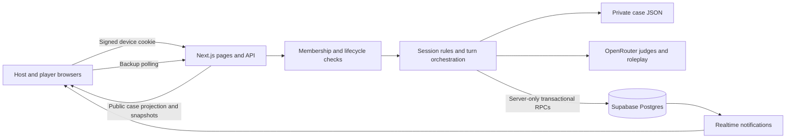
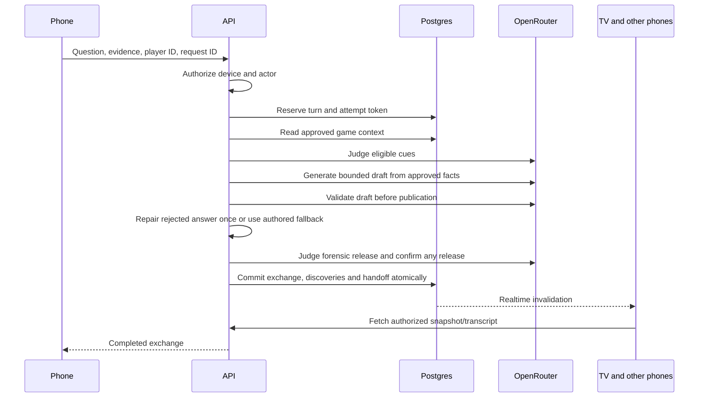
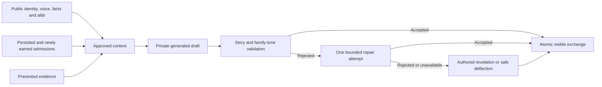
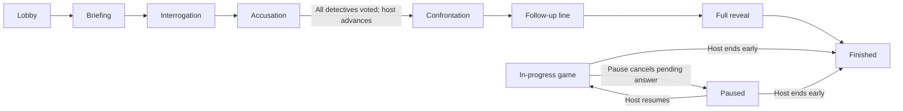

# Architecture — Mystery Engine

**Last reconciled with code: September 18, 2026.** This describes the current working tree. See [P1 delivery](P1_DELIVERY.md) for recorded verification and rollout status, and [PRD](PRD.md) for product targets that are not all implemented.

## 1. System overview

Next.js **16.3.5**, React 19, TypeScript, Tailwind CSS, and Supabase JS **2.105.4** run on pinned Node **22.22.0**. OpenRouter supplies model completions; the default is `openai/gpt-4o-mini`, with environment/case overrides. Production is hosted on Vercel with Supabase; see [September 18 release](RELEASE_2026-09-18.md) for the current release verification. QR codes are rendered by `qrcode`; exhibits are HTML with print styles.

The database is authoritative. React hooks hold snapshots and local interaction state. Browser storage remembers navigation/name hints; it is not proof of identity. The complete private case stays on the server.

## 2. Source map

| Responsibility | Current source |
| --- | --- |
| JSONC loader, schema, validator, generated types | `src/engine/` |
| Device cookie and membership/role authorization | `src/lib/session-auth.ts` |
| Public case projection | `src/lib/public-case.ts` |
| Lifecycle, phase rules, public snapshots, RPC wrapper | `src/lib/session-store.ts` |
| Turn orchestration and host assistance | `src/lib/interview-turn.ts` |
| LangGraph planning and answer routing | `src/lib/interview-graph.ts`, `interview-reply-graph.ts`, `interview-planner.ts` |
| Saved interview clocks and compact countdowns | `src/lib/interview-clock.ts`, `src/components/InterviewClock.tsx`, timed-interviews migration |
| Pending condition enumeration | `src/lib/interview-unlocks.ts` |
| Cue judge and forensic host judge | `src/lib/adjudicator.ts`, `src/lib/host-judgment.ts` |
| Approved roleplay context and response validation | `src/lib/interview-safety.ts` |
| Realtime tokens, clients, snapshot hooks | `src/lib/realtime-auth.ts`, `supabase-client.ts`, `session-realtime.ts` |
| TV and phone UI | `src/components/HostLobbyView.tsx`, `PlayerLobbyView.tsx` |
| Server routes and pages | `src/app/` |
| Schema, grants, RLS, atomic writes, retention job | `supabase/migrations/` |

Case data is separate from engine code, but full case independence is not yet proven. Round-two selection and phase assumptions remain. `loadCase` parses/casts JSONC; it does not run the CLI validator. Stored `case_version` does not pin a historical content snapshot. See [assessment](PROJECT_ASSESSMENT.md) for these follow-ups.

## 3. Identity and data boundaries

Creating/joining a game issues a signed `mystery-device` HttpOnly, SameSite=Strict cookie. The signing key is `SESSION_AUTH_SECRET`, falling back to the server service-role key. Private membership records bind the device to a host and/or player role. A join code permits joining, not host access; supplied player IDs are checked against membership.

Every session page/API checks membership and expiry. Mutations check origin, actor permissions, and game state. Player IDs, join codes, and legacy `players.device_id` values are not credentials. Clearing the cookie loses that device identity; no account recovery flow is implemented.

`toPublicCase` includes public suspect fields, unlocked exhibits, the current chapter, interview-selection skeletons during interrogation, and staged ending material. It excludes private persona, timelines, unlock criteria and unreleased solution data. Printable requests additionally check membership and exhibit unlock state. The general asset route permits only portraits, locations and UI folders.

Members can mint short-lived session JWTs for realtime, with `session_id` and `session_expires_at` claims. Token expiry is capped by game expiry. RLS scopes public reads; private memberships/turns and adjudication details are inaccessible to browser roles. Mutation RPCs and garbage collection are server-only. The service role bypasses RLS, so API authorization remains essential.

## 4. Database and mutation integrity

| Table | Purpose |
| --- | --- |
| `sessions` | Case identity, lifecycle status, phase/scene/chapter, evidence, interviewer, revision, ending path/step, per-suspect time budgets, microphone clock/anchor, retention timestamps |
| `players` | Seats, display names and observer state; legacy device column is not public |
| `session_memberships` | Private device ownership and host privileges |
| `messages` | Committed user/assistant/system transcript rows, ordered within a suspect conversation |
| `interview_turns` | Private request hash, pending/completed/failed/cancelled status, lease, attempt token and saved result |
| `interview_unlock_state` | Private per-condition attempts, pressure, proximity and admitted-state tracking |
| `accusation_votes` | One current vote per detective |
| `events` | Session activity; public API returns sanitized status messages |

`create_game_session` creates the lobby and host membership together. `join_game_session` locks the session while allocating a seat and membership. Late/full-lobby arrivals become observers; promotion is not implemented.

`begin_interview_turn` permits one pending turn per session, with a **120-second lease**. The request ID and input hash identify retries; completed retries return the saved result. A fresh attempt token prevents an expired worker from overwriting its replacement.

`commit_game_update` locks the session and checks its revision. It atomically writes messages, discoveries, votes, events and microphone handoff. Revision conflicts return `PT409`; vote upserts retry bounded conflicts. Pause/end cancel pending turns. An old attempt cannot commit after cancellation or another revision.

## 5. Interview execution and realtime fan-out

No draft tokens are published. The old token-by-token database writer is no longer used; committed messages have `is_streaming=false`. Roleplay history is limited to the most recent 12 non-system messages, and established admissions are included explicitly on later turns. Host judgment still uses growing room transcripts; total session cost/latency is not bounded or measured.

Provider calls have 20-second timeouts and output limits. Roleplay generation failure marks the turn failed without a partial transcript. A LangGraph answer subgraph validates the draft, attempts one repair on rejection, and then selects a validated reply or authored fallback. No rejected draft is published. Host-judge failure does not discard an otherwise valid answer. Question count no longer rotates the microphone. Server-authoritative clocks allow 480 active seconds per suspect and 90 per detective; the host can add 120 seconds. The pending turn lease pauses clocks, and microphone expiry is reconciled by polling and submission checks. Switching suspects preserves budgets; research scenes and host pause suspend them. See [timed interviews](TIMED_INTERVIEWS.md).

Realtime notifications trigger authorized fetches. Hooks reconcile after subscription and keep backup polling; lobby polling is 2.5 seconds, with other hooks using their fallback/safety intervals. Failed token refresh is retried. No measured sub-150ms or two-second answer guarantee is claimed.

## 6. Story boundaries and rescue

Private author persona, true timelines, lies' underlying truth, `neverReveal` lists, and the solution object are not passed to roleplay. Those fields remain authoring references. Conditional `interviewLayers` and `alibiAfterBreakingPoint` supply only the facts/posture earned by committed admissions, including Rhea’s concealment motive after both relevant gates. `shortDescription`, `voice`, `knownFacts`, public alibi and exhibit prose must therefore be suitable for their intended visibility.

The live discovery pipeline uses `unlockBehavior`, not every legacy schema gate. Evidence requirements are checked before cue evaluation. Confidence measures verdict certainty; proximity measures closeness to the cue. Cue-less pressure is counted deterministically. The host can reveal an eligible secret, breaking point or exhibit, or request the next forensic update. Manual rescue does not depend on a judge declaring players stuck.

The host judge can suggest phase changes, but turn execution does not apply them. Human host controls advance phases. Model output validation reduces risk without proving semantic perfection; recorded live results and the remaining Anya cue miss are in [P1 delivery](P1_DELIVERY.md).

## 7. Lifecycle and ending

Lifecycle status (`lobby`, `in_progress`, `paused`, `finished`) and narrative phase (`briefing`, `interrogation`, `accusation`, `reveal`) are separate. A finished game cannot be restarted through normal controls. Pause preserves committed work and cancels the unfinished attempt; resuming permits a retry.

Within interrogation, the host/active interviewer selects suspects freely. At accusation, every detective must vote before confrontation. The larger vote total among the two authored branch suspects selects the path; ties, including neither receiving a vote, choose the first path. The host releases the first line, follow-up line, full solution, then finishes. Ending early does not automatically disclose the solution.

Successful committed game actions extend expiry by seven days. Reads, joins and mutations reject expired games. The migration schedules GC at minute 17 each hour. Review historical expiry timestamps before applying that job to existing data.

## 8. Routes and rollout

- `/case/[caseId]`: case entry; `/case/[caseId]/multiplayer`: lobby launcher.
- `/j/[joinCode]`: join form.
- `/session/[sessionId]/host`: authenticated host display.
- `/session/[sessionId]/player/[playerId]`: owned player controller.
- `/case/[caseId]/solo`: static preview, not a full solo game.
- `/api/sessions` and `/api/join`: creation/join; session-specific APIs handle reads, scene controls, interviewer, interview, assistance, votes, events and realtime tokens.

The recovered-phone screen has Messages, Calls and Notes; a hacking minigame, soundtrack and TTS remain unimplemented. The final recording is a guarded download after the truth reveal; inline playback is deferred. See [README](../README.md) for setup and test commands. Apply the timed-interviews migration before deploying this release. Preserve existing migrations and game data. Earlier integrity migrations are already hosted; only legacy games predating membership lack trustworthy ownership. Physical multi-device rehearsal and sustained load testing remain unverified.
