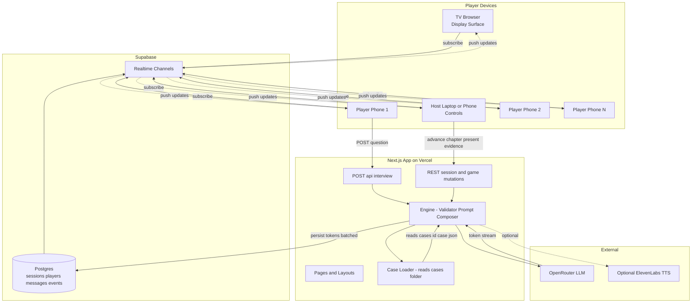
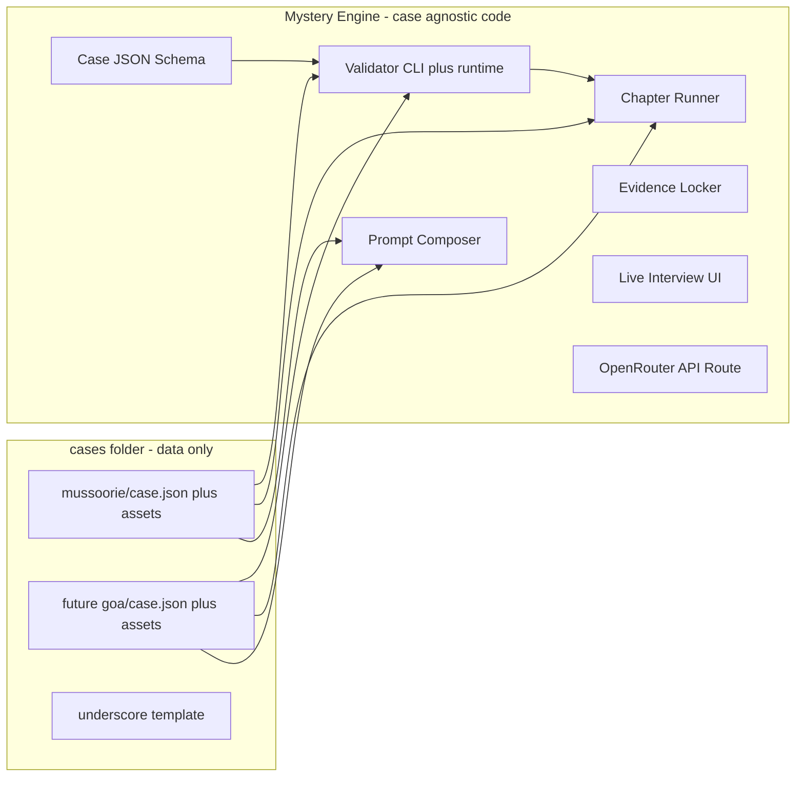
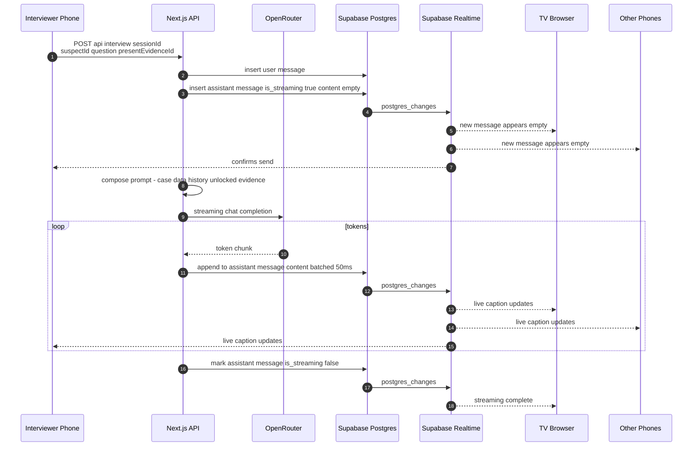
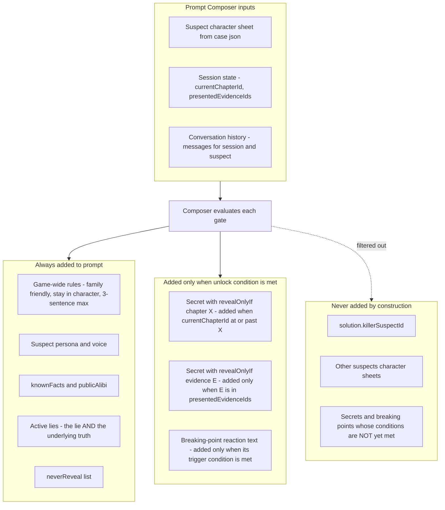
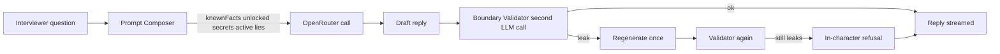
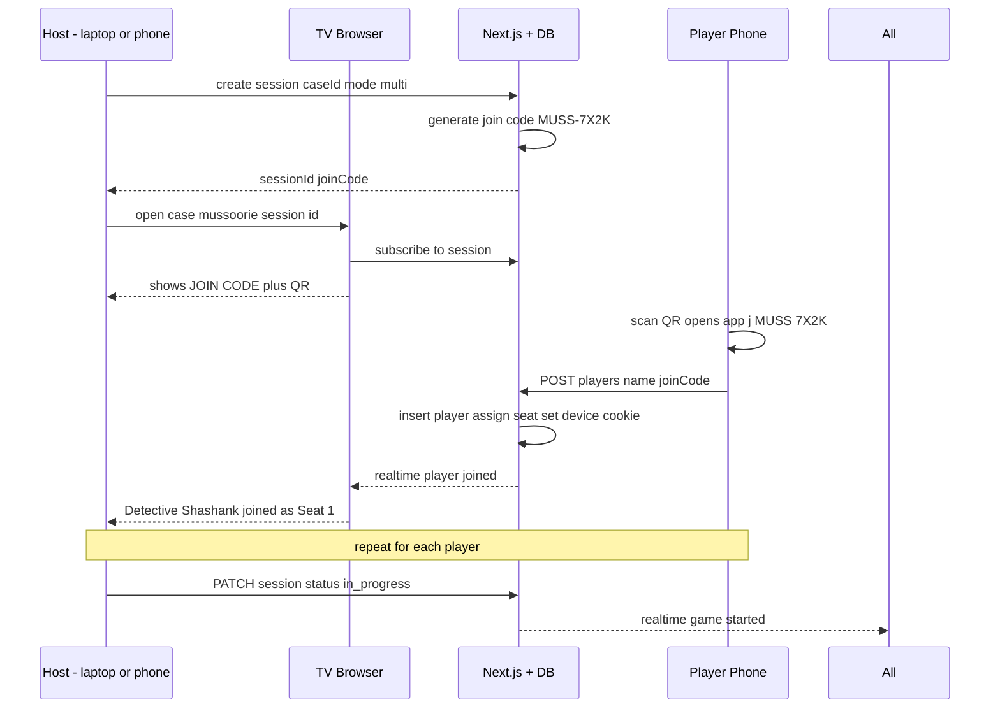
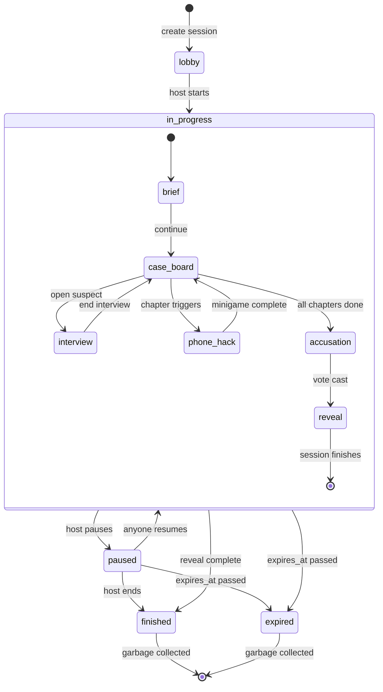

# Architecture — Mystery Engine

**Status**: Draft v1
**Last updated**: 2026-05-14

This document describes the technical architecture of the Mystery Engine: how the case-agnostic engine, JSON case data, multi-device clients, Supabase backend, and OpenRouter LLM fit together.

For product goals and requirements, see [PRD.md](PRD.md).

---

## 1. System overview



Two strict separations:

1. **Engine code** (case-agnostic) vs **case data** (pure JSON + assets).
2. **Display devices** subscribe to session state via Supabase Realtime; **mutations** flow through Next.js API routes that write to Postgres; Realtime fans changes back out to all subscribed devices.

---

## 2. Engine vs cases



- The engine knows **nothing** about Mussoorie or any specific case.
- A case is a folder under `cases/<id>/` containing `case.json`, `assets/`, `printables/`, and an optional `design.md`.
- The single source of truth for the case format is `src/engine/schema/case.schema.json` (JSON Schema 2020-12). TypeScript types are generated from it via `json-schema-to-typescript`.

---

## 3. Repository layout

```
PartyGame/
├── README.md
├── docs/
│   ├── PRD.md
│   ├── ARCHITECTURE.md             # this file
│   └── authoring-guide.md          # how to add a new case
├── package.json
├── next.config.ts
├── tailwind.config.ts
├── src/
│   ├── engine/                     # case-agnostic engine code
│   │   ├── schema/
│   │   │   └── case.schema.json
│   │   ├── types.ts                # generated from schema
│   │   ├── validator.ts            # ajv + cross-reference checks
│   │   ├── prompt/
│   │   │   ├── rules.ts            # game-wide system prompt rules
│   │   │   └── compose.ts          # builds per-suspect system prompt
│   │   ├── state/
│   │   │   └── store.ts            # zustand for transient UI state only
│   │   └── case-loader.ts          # loads case.json, validates, resolves asset paths
│   ├── ui/                         # reusable React components, Case-driven
│   │   ├── ChapterRunner.tsx
│   │   ├── EvidenceLocker.tsx
│   │   ├── SuspectBoard.tsx
│   │   ├── InterviewScreen.tsx
│   │   ├── PhoneHack.tsx
│   │   ├── Accusation.tsx
│   │   ├── Reveal.tsx
│   │   └── theme/
│   │       └── noir.ts             # default theme; cases override via case.theme
│   ├── app/                        # Next.js App Router
│   │   ├── page.tsx                # case picker (skipped if CASE_ID env var set)
│   │   ├── case/[caseId]/page.tsx  # the game runner (TV view)
│   │   ├── j/[code]/page.tsx       # phone join page
│   │   ├── play/[sessionId]/page.tsx   # phone controller view
│   │   └── api/
│   │       ├── session/route.ts    # create / mutate sessions
│   │       └── interview/route.ts  # OpenRouter proxy with prompt composer
│   └── lib/
│       ├── case-registry.ts        # discovers cases at build time
│       └── supabase.ts             # Supabase client setup
├── scripts/
│   ├── validate-case.ts            # CLI: pnpm validate-case mussoorie
│   └── generate-types.ts           # regenerates src/engine/types.ts from schema
├── supabase/
│   ├── migrations/                 # SQL migrations
│   └── seed.sql                    # case registry seed
└── cases/
    ├── _template/                  # copy this to start a new case
    ├── mussoorie/
    │   ├── case.json
    │   ├── assets/
    │   ├── printables/
    │   └── design.md
    └── ...future cases
```

---

## 4. Tech stack

| Concern | Choice | Why |
|---|---|---|
| Web framework | Next.js 14 (App Router) + TypeScript | Fast dev, easy Vercel deploy, server actions and API routes co-located |
| Styling | Tailwind CSS + custom noir theme | Quick to iterate; per-case theme overrides |
| Case format | JSONC at `cases/<id>/case.json`, `$schema` reference | Author-friendly, IDE autocomplete, validates at edit time |
| Schema | JSON Schema 2020-12, `ajv` for runtime, `json-schema-to-typescript` for types | Single source of truth, type-safe in code, validatable as data |
| Backend | Supabase (Postgres + Realtime) | Built-in realtime; standard SQL; portable; free tier |
| Client state | `zustand` for transient UI; server state via Supabase Realtime | DB is the source of truth; no localStorage for game data |
| LLM | OpenRouter | One API, swappable models via env var; cases can override per-case |
| Streaming | Server-side OpenRouter stream → batched DB writes → Supabase Realtime | Fans out to all devices uniformly |
| QR codes | `qrcode` npm lib (server-rendered) | Simple, reliable |
| PDFs | Static in `cases/<id>/printables/` (v1); `@react-pdf/renderer` if dynamic later | Predictable, printable on plain A4 |
| Audio | HTML5 `<audio>`; optional ElevenLabs TTS in Phase 5 | Lightweight |
| Deploy | Vercel (Next.js) + Supabase free tiers | Both free for personal use |

---

## 5. Data model

### 5.1 Case JSON schema (high-level)

```ts
// generated from src/engine/schema/case.schema.json
interface Case {
  $schema?: string;                 // points to the schema for IDE support
  id: string;                       // "mussoorie"
  version: string;
  engineVersion: string;            // semver range
  meta: CaseMeta;                   // title, tagline, duration, ageRating, cover
  victim: Victim;
  suspects: Suspect[];              // 4-8
  evidence: Evidence[];
  chapters: Chapter[];              // ordered, with prerequisites
  solution: Solution;               // NEVER sent to LLM
  theme?: ThemeOverride;
  llm?: { modelOverride?: string; temperature?: number };
}

interface Suspect {
  id: string;
  name: string;
  portraitUrl: string;
  persona: string;                  // for LLM
  voice: string;                    // speaking style
  knownFacts: string[];
  publicAlibi: string;
  lies: Lie[];                      // model is told the lie AND the truth
  secrets: Secret[];                // each gated by an UnlockCondition
  breakingPoints: BreakingPoint[];
  neverReveal: string[];
  introducedAtChapter: string;
}

type UnlockCondition =
  | { type: "evidence"; evidenceId: string }
  | { type: "chapter"; chapterId: string }
  | { type: "all"; conditions: UnlockCondition[] }
  | { type: "any"; conditions: UnlockCondition[] };

type Chapter =
  | { type: "narrative"; ... }
  | { type: "evidence-reveal"; evidenceIds: string[]; printablePrompt?: string }
  | { type: "interview"; suspectId: string; presentableEvidence: string[] }
  | { type: "phone-hack"; ... }
  | { type: "accusation" }
  | { type: "reveal" };

interface Solution {
  killerSuspectId: string;
  motive: string;
  meansAndMethod: string;
  timeline: TimelineEvent[];
  revealNarration: Beat[];
  redHerrings: { suspectId: string; explanation: string }[];
}
```

### 5.2 Postgres schema (Supabase)

Session state lives in the database, not in client memory. All clients read via Realtime subscriptions; mutations go through Next.js API routes.

```sql
-- One row per active or paused game
sessions (
  id              uuid primary key,
  case_id         text not null,            -- "mussoorie"
  case_version    text not null,
  join_code       text unique not null,     -- "MUSS-7X2K"
  mode            text not null,            -- "solo" | "multi"
  status          text not null,            -- "lobby" | "in_progress" | "paused" | "finished"
  current_scene   text not null,            -- lobby|brief|case_board|interview|phone_hack|accusation|reveal
  current_chapter_id              text,
  current_interviewer_player_id   uuid,
  current_interview_suspect_id    text,
  unlocked_evidence               text[]     not null default '{}',
  presented_evidence_by_suspect   jsonb      not null default '{}',
  accusation_target_suspect_id    text,
  created_at, updated_at, last_activity_at,
  expires_at      timestamptz                -- 7 days idle, configurable
);

players (
  id              uuid primary key,
  session_id      uuid references sessions(id) on delete cascade,
  name            text not null,
  seat_number     int  not null,
  is_host         boolean not null default false,
  device_id       text not null,             -- random cookie for reconnect
  joined_at, last_seen_at
);

messages (
  id                  uuid primary key,
  session_id          uuid,
  suspect_id          text not null,
  role                text not null,         -- "user" | "assistant"
  content             text not null default '',
  presented_evidence_id text,
  asked_by_player_id  uuid references players(id),
  is_streaming        boolean not null default false,
  sequence            int  not null,         -- per (session, suspect)
  created_at, updated_at
);

events (
  id           uuid primary key,
  session_id   uuid,
  type         text not null,                 -- player_joined | control_passed | evidence_presented | chapter_advanced | accusation_cast | etc.
  payload      jsonb not null,
  created_at
);
```

Realtime publications enabled on all four tables. RLS policies scoped by `session_id` (set in a signed cookie).

---

## 6. Streaming and realtime fan-out

The **DB is the source of truth**. The interviewer's phone is just one of N subscribers — it sees the same stream as everyone else.



Key properties:

- Token batching (~50ms) keeps DB write rate manageable; perceived latency stays under ~150ms.
- Reconnecting devices catch up by reading the row state directly.
- Same pattern handles non-interview state changes: chapter advance, evidence unlock, control pass, vote cast.

---

## 7. LLM architecture and boundaries

### 7.1 Prompt composition

Every interview turn, the API route composes a system prompt from:

1. **Game-wide rules** (`src/engine/prompt/rules.ts`) — stay in character, ≤3 sentences, no fourth-wall breaks, family-friendly tone.
2. **Case context** — case meta + victim summary (only what's publicly known so far).
3. **Suspect persona, voice, alibi, known facts** — from the case JSON.
4. **Active lies** — the model is told both the lie AND the truth and instructed to maintain the lie.
5. **Secrets unlocked so far** — only if their `revealOnlyIf` condition is met (chapter reached or evidence presented).
6. **Breaking points unlocked so far** — same gating rule.
7. **Never-reveal list** — explicit forbidden topics. The killer's identity is excluded from context entirely (never appears in the prompt).
8. **Conversation history** — appended as prior `user` and `assistant` messages from the `messages` table for this `(session, suspect)`.

The composer evaluates each gate against current session state. The diagram below shows exactly what is and is not in the prompt at any given moment:



**Concrete example** — Naina's prompt during her interview in chapter 3:

| Game moment | What is in her prompt |
|---|---|
| Interview opens at chapter 3 | rules + persona + voice + knownFacts + publicAlibi + active lies + neverReveal |
| Interviewer presents `pawn-shop-receipt` | …all of the above, plus the "ring" secret (gated by that evidence) |
| Interviewer presents `cctv-still-camels-back` | …plus the breaking-point reaction text "drops the room alibi, admits walking" |
| Throughout | `solution.killerSuspectId` is **never** in context, regardless of evidence shown |

### 7.2 Boundary enforcement (defense in depth)



Layers:

1. **In-prompt rules** (always on) — explicit forbidden topics, killer identity excluded from context, deflection guidance.
2. **Phase gating** (always on) — only facts/secrets/breaking-points whose chapter prerequisites are met enter the prompt.
3. **Evidence-triggered unlocks** (always on) — a secret/breaking-point joins the prompt only after the interviewer has presented its triggering evidence.
4. **Validator pass** (default on) — a fast second LLM call screens the draft against a short rubric (does not name the killer, does not reveal unrevealed secrets, family-friendly). On failure: regenerate once, then fall back to an in-character refusal line.

### 7.3 Cost / latency budget

- ~80–150 messages per session × ~500 tokens average × small-model pricing → typically **under $1 per session**.
- Validator pass is short (~100 tokens out) and uses the same fast model.

---

## 8. Display modes

The TV is a **passive display**; it always renders whatever the session's `current_scene` says. Phones are **context-aware controllers**; they render based on (current_scene, am-I-the-interviewer, am-I-the-host).

| Scene | TV shows | Interviewer phone | Other phones |
|---|---|---|---|
| `lobby` | Big join code + QR + joined-player list | n/a | Name input → joined; host gets Start button |
| `brief` | Cinematic image, voiced text overlay, music | "Continue" advances when ready | Read-along of the brief |
| `case_board` | Suspect grid + evidence locker carousel + current chapter banner | "Open Suspect" → starts an interview | Browse evidence, read suspect dossiers |
| `interview` | Suspect portrait, scrolling chat, "Detective \[Name\] is asking…" | Question input + Present-evidence + Pass-control | Read-only chat view, can browse evidence |
| `phone_hack` | Mock victim's phone UI | Drives scrubbing (texts, call log, notes) | Watch TV |
| `accusation` | All six suspects shown big, live tally appears | Vote card | Vote card |
| `reveal` | Cinematic killer reveal (face, motive, timeline, music swell) | Verdict card | Verdict card |

Routes:

- `/case/[caseId]` — the TV view; auto-navigates by `sessions.current_scene`
- `/j/[code]` — phone landing for a join code
- `/play/[sessionId]` — phone controller view; auto-renders the right mode based on session state and player role

In Solo mode the host's screen acts as both TV and interviewer; phones aren't required.

---

## 9. Lobby and player registration



Specifics:

- **Join code** is `<CASESLUG>-<4 alphanumeric>`, avoiding ambiguous chars (no `0`/`O`, no `1`/`I`).
- **QR code** points to `https://app.com/j/<code>`.
- **Device identity** = random `device_id` cookie. Closing/reopening the page rejoins the same seat.
- **Host** = creator. Privileged controls: Start, Pause, End. Transferable.
- **Late join** = observer by default; can become interviewer when control is passed.
- **Resume** = re-enter join code; if `status != finished` and `expires_at > now()`, the session reloads from `current_scene`.
- **Solo mode** = skip lobby, single virtual player.

---

## 10. Pause and resume

Session lifecycle is modeled as a state machine. The outer states track `sessions.status`; while a session is `in_progress`, the inner machine tracks `sessions.current_scene`. Transitions to `paused`, `finished`, or `expired` can happen from any inner scene.



- A session has `status ∈ {lobby, in_progress, paused, finished}` and an `expires_at` timestamp (default 7 days from `last_activity_at`, configurable).
- Host taps Pause → `status=paused`. All clients show a paused overlay; the session persists.
- Anyone re-opens the URL or re-enters the join code → server checks `status` and `expires_at`; if valid, all clients re-subscribe and render `current_scene`.
- Garbage collection: a scheduled Supabase function deletes sessions where `now() > expires_at`.

---

## 11. Security and privacy

- **No accounts**, no email, no password. Display name only.
- **OpenRouter API key** is server-only (`OPENROUTER_API_KEY` env var). Never sent to clients.
- **Supabase API keys**: server uses the service role key in API routes; clients use the anon key plus a signed `session_id` cookie. RLS policies scope every read/write to that session.
- **No PII** beyond display names; no analytics or tracking in v1.
- **Player chat content** is retained for the session lifetime only (default 7 days), used solely for gameplay continuity.
- **Content safety**: family-friendly tone enforced in the system prompt; validator pass screens replies; case `meta.ageRating` declares the content rating.

---

## 12. Deployment

- **Vercel** for Next.js. One project. Environment variables:
  - `OPENROUTER_API_KEY`, `OPENROUTER_MODEL` (default), `OPENROUTER_VALIDATOR_MODEL` (optional)
  - `NEXT_PUBLIC_SUPABASE_URL`, `NEXT_PUBLIC_SUPABASE_ANON_KEY`, `SUPABASE_SERVICE_ROLE_KEY`
  - `CASE_ID` (optional — skip the picker if set)
- **Supabase**: one project. Migrations in `supabase/migrations/` apply via the Supabase CLI.
- **Local dev**: Supabase local stack via `supabase start`; Next.js via `pnpm dev`. Ngrok or similar to test phone-as-controller against a local TV view.
- **CI**: lint + typecheck + `pnpm validate-case <id>` for every case in the repo.

---

## 13. Future considerations

(Not in v1; called out so the architecture leaves room for them.)

- **Per-suspect TTS** — feed LLM reply through a voice model; cache audio in Supabase Storage. Schema already has space for `suspect.ttsVoiceId`.
- **Conversation summarization** — when a `(session, suspect)` chat exceeds ~40 turns, run a compression pass and store the summary in `messages.metadata`; the prompt composer prefers the summary + last-N turns.
- **Public case marketplace** — `cases/` could be moved to Supabase Storage with metadata in Postgres; the case-loader becomes async.
- **Voice question input** — browser SpeechRecognition → text question; same pipeline thereafter.
- **Spectator-only links** — share a read-only viewer URL for friends not playing.
- **Replay export** — render the full session transcript as a printable PDF "case file" memento.
