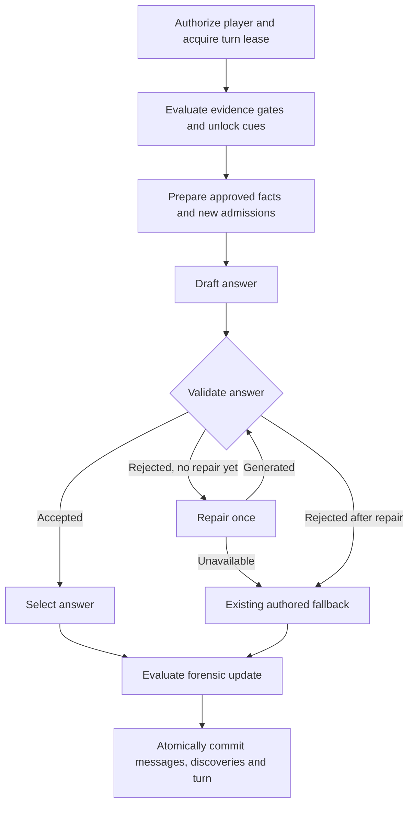

# Interview orchestration with LangGraph

Implemented on 18 September 2026; rollout status is tracked in [September 18 release](RELEASE_2026-09-18.md). LangGraph was not previously installed. The application now uses `@langchain/langgraph` 1.4.16 for production interview planning and answer routing. Dependencies and lockfile are pinned.

## Flow



The LangGraph boundary covers evidence/unlock planning, approved-fact preparation, and the answer subgraph. Authorization, lease acquisition, host forensic judgment and the atomic database commit remain in the existing turn service.

## Implementation

- `src/lib/interview-graph.ts`: production planning graph. Builds facts from the current suspect's committed discoveries plus discoveries earned on this turn. Returns a selected answer and planned updates, not raw graph state.
- `src/lib/interview-planner.ts`: existing evidence gates, cue judging and pressure rules moved without changing their logic. Compatibility exports remain in `interview-turn.ts` for existing callers.
- `src/lib/interview-reply-graph.ts`: draft → validate → deliver, or one repair → validate → deliver/fallback. Graph state is invocation-local.
- `src/lib/interview-safety.ts`: existing OpenRouter transport; passes new admissions explicitly into generation. Validation retains the existing safety/fidelity policy and approved-fact context, including earned admissions. Its decision is still probabilistic; it does not enforce completeness deterministically.
- `src/lib/interview-turn.ts`: invokes the graph, then performs the existing forensic work and database commit. The internal completion event includes graph version, visited nodes and whether repair was attempted; it does not log raw graph state or rejected text.
- `scripts/eval-rhea.ts`: now invokes the same production graph rather than reconstructing its planning sequence. Live reports include the graph path, initial draft, final candidate, selected reply and repair flag. Default filenames include a timestamp to preserve earlier reports.

## Persistence and retry contract

The existing Supabase turn lease, revision/attempt fencing and atomic commit remain the source of truth. A successful turn commits its messages and discoveries together. A duplicate completed request returns the prior committed result. An initial provider failure still fails the turn and releases it through the existing failure path. A failed optional repair falls back.

There is **no LangGraph checkpointer or mid-turn resume** in this implementation. A process crash before commit can require re-running model calls. A second database of graph checkpoints would need an explicit reconciliation design with the current revision/lease protections; it has not been added implicitly. Long-term interview memory is the existing committed transcript and unlock state, reloaded for each turn. The model sees the most recent 12 non-system messages plus persistent approved admissions.

No LangSmith integration or hosted LangGraph service is configured by this change. Application-level traces record node names and repair status. Private graph state must never be streamed to players; the HTTP endpoint continues returning the existing public turn response.

## Bounds

- Maximum one answer repair, followed by validation. No automatic node retry policy or unbounded agent/tool loop.
- Initial generation retains its 20-second timeout. Validation and repair calls each use 10 seconds.
- The worst-case provider timeout budget is approximately 90 seconds: parallel cue evaluation (20), draft (20), first validation (10), repair (10), second validation (10), forensic judgment (20), excluding database and other overhead.
- The interview route declares a 120-second maximum duration, matching the existing database turn lease. A late commit is still rejected by the database fencing rules.
- Evidence availability and player/phase checks happen before graph execution. Running the graph directly is an internal/testing operation, not a substitute for the authorized turn API.

## Remaining story defects

This change is an orchestration foundation and a stronger admission-delivery prompt. It does not author Rhea's missing phone records, reconcile the sale buyer, split the CCTV/financial revelation, or add laptop-deletion facts. See `docs/reviews/RHEA_INTERVIEW_REVIEW.md`.

The final fallback intentionally retains the existing authored revelation text. Consequently, a rejected generated answer and rejected repair can still expose a third-person reaction when that is how the case is authored. Case content needs first-person canonical fallback dialogue; LangGraph itself does not make that text correct. A repair may also pass an imperfect model validator. Evals remain necessary.

## Verification

`tests/interview-graph.test.mjs` covers accepted answers, repaired answers, repeated rejection, repair outage, initial provider outage, invocation isolation, and propagation of a Rhea unlock into both generation and validation. Existing planner tests cover absent/wrong evidence and already-met discoveries. The database integration suite exercises the actual orchestrator with provider failures and rejected answers, alongside transaction/idempotency checks.

```sh
npm test
npm run lint
npm run build
npm run test:integration
npm run eval:rhea -- --repeat 1
```

Live quality evals can exit nonzero because they correctly report unresolved story defects; that is different from an infrastructure or graph execution failure. The pre-graph transcript remains in `output/evals/rhea-deep-review.json`.

Official references: [LangGraph Graph API](https://docs.langchain.com/oss/javascript/langgraph/graph-api), [persistence](https://docs.langchain.com/oss/javascript/langgraph/persistence).

The first live graph run (`rhea-langgraph-v1.json`, 18 conversations/59 answers) also trialled a stricter validator requiring every admission. That policy increased fallback use and was removed before finalizing this migration. The report is retained as an experiment, not a result for the final implementation. Mandatory-admission validation needs structured authored facts and an independently calibrated check, not simply a stricter paragraph in the existing validator prompt.

## Historical graph-only verification, before subsequent Rhea tuning

- Production build and lint passed; unit suite: 157 passed, 1 skipped.
- Database integration: 194 assertions passed.
- Offline investigator contracts: 94 checks passed; the two previously identified missing-proof exhibits still cause the quality command to exit nonzero.
- Final live graph run: 18 conversations, 59 answers, 0 execution errors and 0 unlock mismatches. There were 21 repair attempts; 3 repaired answers were accepted by the production validator.
- The independent grader flagged 12 conversations, and 9 answers still contained the authored narrator fallback. These are unresolved quality findings, not a clean Rhea release. Grader limitations from the detailed review still apply.
- Final raw report: `output/evals/rhea-langgraph-final.json`. Local application rebuilt and restarted on port 3100. No deployment was performed during that graph-only check. Subsequent tuning and timed-interview rollout are covered in [Rhea tuning](reviews/RHEA_SUSPECT_TUNING.md) and [September 18 release](RELEASE_2026-09-18.md).
