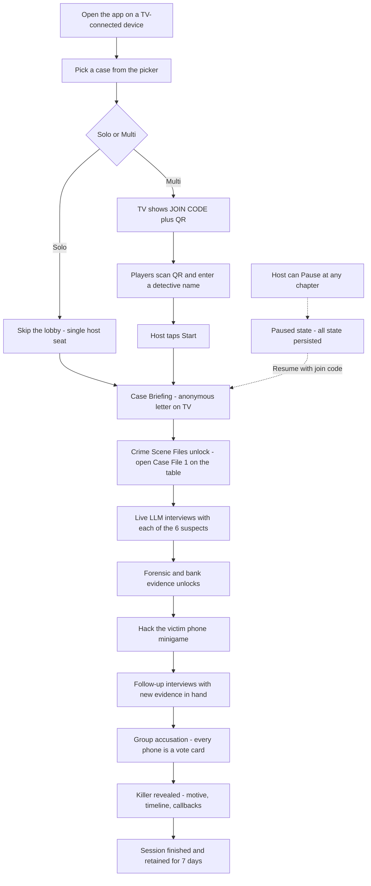

# Product Requirements Document — Mystery Engine + "Murder in Mussoorie"

**Status**: Draft v1
**Owner**: Shashank Mendiratta
**Last updated**: 2026-05-14

---

## 1. Vision

Build a reusable, case-agnostic **Mystery Engine** that powers cinematic, cooperative whodunit experiences for groups of family or friends. Each "case" is a self-contained mystery shipped as a JSON file plus assets; the engine renders it on a TV with synchronized phone controllers, and powers live, in-character suspect interrogations through an LLM with strict story-safety boundaries.

The first case shipped is **Murder in Mussoorie**, a family-friendly noir mystery set in the Indian hill town.

The product takes its inspiration from [Murder in Prague](https://murderinprague.com/), but evolves the experience with:

- **Live LLM-driven suspect interviews** instead of pre-recorded video
- **Multi-device play** — TV display + every player's phone — instead of a single interactive web app
- **A reusable engine** with a JSON case format so new cases can be authored (by humans or LLMs) without writing code

---

## 2. Goals and non-goals

### Goals

1. Deliver a complete, polished, replayable family game ("Murder in Mussoorie") that 6–8 people can play in 2.5–3 hours.
2. Build the engine as a reusable framework so future cases can be added by dropping a folder into `cases/`.
3. Ship live LLM-driven suspect interrogation that stays in character, respects story-safety boundaries, and never leaks the solution.
4. Support both **Solo / TV-only** and **Multiplayer / Lobby + phones** play modes from the same codebase.
5. Persist sessions so a game can be paused and resumed within ~7 days.
6. Keep the per-session LLM cost under $1 for a typical playthrough.

### Non-goals (v1)

- Player accounts, profiles, social graphs, or matchmaking
- Public discovery or marketplace of community-authored cases
- A pure-offline mode (the game requires internet for LLM and Realtime)
- Native mobile apps (web only — phones use the browser)
- Voice input / voice synthesis for suspects (TTS is a Phase 5 polish, not v1 core)
- Internationalization / non-English language support
- Real-money payments, subscriptions, or DRM

---

## 3. Target users

| Persona | Description | Primary need |
|---|---|---|
| **The Host** | Tech-comfortable family member or friend organizing a game night | Setup is fast; running the game is reliable; pause/resume just works |
| **The Detectives (Players)** | Family members ages 10+ or adult friends; mixed technical comfort | Feels cinematic and fair; phone UI is dead-simple; no logins |
| **The Author** | The product creator (Shashank) and possibly future case writers | A clear schema and authoring guide; can draft cases with an LLM and validate before publishing |

The audience for *gameplay* is family-friendly (ages 10+); the audience for *case authoring* is technical or AI-assisted.

---

## 4. User scenarios

### S1 — Family game night (Multiplayer mode)

> It's Saturday evening. Six family members gather around the TV. The host opens the app on a laptop connected to the TV via HDMI. They pick "Murder in Mussoorie" and tap "Multiplayer." A join code (`MUSS-7X2K`) and QR code appear on the TV. Everyone scans, types their name, and joins their seat. The host taps Start. Over the next ~3 hours the group watches case files unfold on the TV, takes turns interrogating suspects on their phones, presents evidence, debates over chai, and finally votes for the killer. The TV reveals the truth.

### S2 — Solo / TV-only play

> One player wants to try the case alone before hosting. They open the app, pick "Solo." No lobby. They drive everything from their laptop — advance chapters, ask suspects questions, present evidence — using the same engine. The TV view and the controller view live on the same screen.

### S3 — Pause and resume

> Halfway through, the family decides to break for dinner. The host taps Pause. The next evening, anyone re-opens the URL or re-enters the join code; the session resumes at the same chapter, with all evidence and interview transcripts intact.

### S4 — Mid-game late join

> A cousin arrives an hour late. They scan the QR code; the app puts them in as an observer; they can browse evidence and read suspect chats but can't drive an interview. When the current interviewer presses "Pass control," the cousin can be selected and become the next interviewer.

### S5 — Author drafting a new case

> The product creator wants to add a second case set in Goa. They copy `cases/_template/`, open `case.json`, and use Cursor with the `$schema` reference to autocomplete the structure. For long prose (suspect personas, narrative beats), they paste the schema into Gemini and have the LLM draft the JSON. They run `pnpm validate-case goa` — the validator catches three broken evidence references and a missing breaking point. They fix and re-validate. The case appears in the picker.

---

## 5. Gameplay flow at a glance

### 5.1 End-to-end workflow

A typical playthrough, step by step:

### 5.2 Host vs Player journey

What the **host** drives versus what a **player** does, side by side:

```mermaid
flowchart LR
    subgraph hostFlow [Host journey]
        direction TB
        H1[Open the app on a TV-connected device]
        H2[Pick a case and choose Solo or Multi]
        H3[Multi - share JOIN CODE and QR shown on TV]
        H4[Tap Start when everyone has joined]
        H5[Watch chapters unfold - intervene only if needed]
        H6[Pause or End the session at any time]
        H7[Reveal plays on TV - debrief with the group]
        H1 --> H2 --> H3 --> H4 --> H5 --> H6 --> H7
    end
    subgraph playerFlow [Player journey]
        direction TB
        P1[Scan QR on TV or open the join URL]
        P2[Type a detective name and join a seat]
        P3[Wait in lobby until host starts]
        P4[Read briefs and study evidence on phone and TV]
        P5[Become the Interviewer when control is passed]
        P6[Ask suspect questions - present evidence]
        P7[Pass control or wait for the next chapter]
        P8[Vote in the accusation]
        P9[See the verdict on phone and TV]
        P1 --> P2 --> P3 --> P4 --> P5 --> P6 --> P7 --> P8 --> P9
    end

    H4 -.->|game starts for everyone| P4
    H5 -.->|host advances the chapter| P5
```

In **Solo mode** the host's screen is also the player's screen — the right-hand lane collapses into the left.

---

## 6. Functional requirements

### 6.1 Engine (case-agnostic)

- **F-ENG-1**: The engine MUST load any case from `cases/<id>/case.json` plus its sibling assets folder.
- **F-ENG-2**: The engine MUST validate cases against `case.schema.json` at load time. Invalid cases MUST be rejected with a clear error.
- **F-ENG-3**: The engine MUST run cross-reference checks: every `evidenceId`/`suspectId`/`chapterId` reference resolves; chapter prerequisites form a DAG; the solution killer is a real suspect; every suspect has ≥1 breaking point; all asset paths exist.
- **F-ENG-4**: The engine MUST drive a chapter sequence, evidence locker, suspect board, accusation, and reveal — all without case-specific code.
- **F-ENG-5**: Adding a new case MUST require only a new folder under `cases/`. No engine code changes.

### 6.2 Case authoring

- **F-AUTH-1**: A `cases/_template/` scaffold MUST exist with a minimal valid `case.json` containing TODO markers.
- **F-AUTH-2**: An authoring guide (`docs/authoring-guide.md`) MUST describe how to draft cases by hand or with an LLM, including a copy-paste prompt for LLM authoring.
- **F-AUTH-3**: A CLI script (`pnpm validate-case <id>`) MUST validate a case and exit non-zero on any error.
- **F-AUTH-4**: Case JSON MUST support a `$schema` reference for IDE autocomplete and inline validation.

### 6.3 Lobby and player registration (Multiplayer mode)

- **F-LOB-1**: The host MUST be able to create a session and receive a unique 8-character join code (e.g., `MUSS-7X2K`) and a QR code linking to `/j/<code>`.
- **F-LOB-2**: Players MUST be able to join via QR scan or by typing the code. No accounts. Name only.
- **F-LOB-3**: Each player MUST be assigned an incrementing seat number on join.
- **F-LOB-4**: A `device_id` cookie MUST identify each device for reconnect; closing/reopening the page MUST rejoin the same seat.
- **F-LOB-5**: The host (creator) MUST have privileged controls (Start, Pause, End). Host role MAY be transferable.
- **F-LOB-6**: Late join during play MUST be allowed by default and put the joiner in observer mode. Host MAY disable mid-game.

### 6.4 Solo mode

- **F-SOLO-1**: A "Solo" entry MUST skip the lobby entirely.
- **F-SOLO-2**: In Solo mode, the host's screen MUST act as both the TV display and the active interviewer's controller.
- **F-SOLO-3**: Solo and Multiplayer MUST share one codebase (one engine, one case format, one DB schema).

### 6.5 TV display

- **F-TV-1**: The TV is a passive display: it always renders the scene specified by `sessions.current_scene`.
- **F-TV-2**: The TV MUST auto-navigate through scenes (Lobby → Brief → Case Board → Interview → Phone Hack → Accusation → Reveal) via Realtime subscriptions. No manual TV interaction required.
- **F-TV-3**: The TV MUST be readable from a typical living-room distance: large fonts, high contrast, generous padding.

### 6.6 Phone controllers

- **F-PHONE-1**: Each phone's view MUST be reactive: based on (`current_scene`, `is_interviewer`, `is_host`).
- **F-PHONE-2**: The current interviewer's phone MUST show a question input, a Present-Evidence button, and a Pass-Control button.
- **F-PHONE-3**: All other phones MUST show a read-only chat view and an Evidence Locker browser.
- **F-PHONE-4**: During Accusation, every phone MUST become a vote card; one tap to vote.

### 6.7 Live LLM interview

- **F-LLM-1**: The interviewer MUST be able to send a question; an empty `assistant` message row MUST be created immediately and stream tokens from OpenRouter.
- **F-LLM-2**: All subscribed devices (TV + phones) MUST see the streamed reply in real time, with a perceived latency under ~150ms per token-batch.
- **F-LLM-3**: The interviewer MUST be able to attach an evidence card to a question ("Present evidence"); the engine MUST inject a `[Evidence shown: …]` block into the next prompt.
- **F-LLM-4**: The interviewer MUST be able to pass control to any other player at any time, including mid-interview.
- **F-LLM-5**: A reset-conversation control MUST be available to the host (in case of a derailment).

### 6.8 LLM boundary enforcement

- **F-BND-1**: The case's `solution` field MUST NEVER be included in any LLM prompt.
- **F-BND-2**: A suspect's secret MUST only be added to the prompt when its `revealOnlyIf` condition is met (chapter reached or evidence presented).
- **F-BND-3**: The system prompt MUST include a fixed game-wide ruleset (stay in character, ≤3 sentences, no fourth-wall breaks, family-friendly tone).
- **F-BND-4**: A validator pass (second LLM call) MUST screen draft replies against a short rubric (does not name the killer, does not leak unrevealed secrets, family-friendly). On failure, regenerate once; on second failure, return an in-character fallback line.

### 6.9 Pause and resume

- **F-PR-1**: A session MUST persist all state to Postgres; closing every device MUST not lose progress.
- **F-PR-2**: Re-opening the URL or re-entering the join code MUST resume the session from `current_scene` and `current_chapter_id`.
- **F-PR-3**: Sessions MUST auto-expire after a configurable idle window (default 7 days).

### 6.10 Printables (per case)

- **F-PRINT-1**: Each case MAY ship printable PDFs in `cases/<id>/printables/`.
- **F-PRINT-2**: Mussoorie MUST ship: police report, autopsy-lite, bank statement, phone log, newspaper clipping, anonymous letter, map of Mussoorie, evidence-baggie checklist.

---

## 7. Non-functional requirements

### 7.1 Performance

- **NFR-PERF-1**: TV view MUST render the lobby/brief/case-board within 1 second of route load.
- **NFR-PERF-2**: LLM streaming MUST start emitting tokens within 2 seconds of question submission for the default model.
- **NFR-PERF-3**: Realtime fan-out MUST deliver token batches to all devices within ~150ms of DB write.

### 7.2 Cost

- **NFR-COST-1**: A typical 3-hour playthrough MUST cost less than $1 of LLM spend on the default model.
- **NFR-COST-2**: Hosting (Vercel + Supabase) MUST fit in free tiers for personal use.

### 7.3 Reliability

- **NFR-REL-1**: A device disconnect MUST be transparent: on reconnect, the device MUST catch up to current state from DB.
- **NFR-REL-2**: A failed LLM call MUST surface a retry button for the interviewer; it MUST NOT corrupt the session.

### 7.4 Content safety

- **NFR-SAFE-1**: All LLM output MUST pass family-friendly checks. The system prompt enforces this; the validator pass is a safety net.
- **NFR-SAFE-2**: Cases MUST follow a content rating field (`meta.ageRating`). The Mussoorie case is "10+". No graphic violence, no sexual content, no substance abuse depictions.

### 7.5 Security and privacy

- **NFR-SEC-1**: No PII collected beyond a freeform display name.
- **NFR-SEC-2**: OpenRouter API key MUST be server-only (env var); never sent to clients.
- **NFR-SEC-3**: Supabase RLS policies MUST scope all reads/writes to the session id known to the client (via signed cookie).
- **NFR-SEC-4**: Player chat content MUST NOT be used for any purpose beyond gameplay during the session lifetime.

### 7.6 Accessibility

- **NFR-A11Y-1**: TV view MUST support large-text mode and high-contrast mode.
- **NFR-A11Y-2**: All interactive controls on phones MUST have ≥44px touch targets.

---

## 8. Success metrics

- **M1**: A test family of 6–8 plays a full session of "Murder in Mussoorie" without the host needing to intervene to fix bugs.
- **M2**: ≥1 person (not the author) successfully drafts a new case by following the authoring guide.
- **M3**: Session pause/resume works after a 24-hour gap with all state intact.
- **M4**: Average per-session LLM cost ≤ $0.50 on the default model.
- **M5**: ≥80% of post-game survey respondents (family playtests) say "I would play another case."

---

## 9. Out of scope for v1

- TTS audio for suspect voices (deferred to Phase 5 polish if time permits)
- A community case marketplace
- A separate "case author" web UI (authoring is via JSON + IDE in v1)
- Cross-session memory ("the suspect remembers you from last week")
- Multi-language support
- Video evidence (still images and audio only in v1)
- Public hosted version with shared OpenRouter key (each host brings their own)

---

## 10. Open questions

- **OQ-1**: Should the validator pass (Phase 2g, second LLM call) be on by default, or opt-in via a `safetyLevel` field on the case? (Default: on.)
- **OQ-2**: Should we allow the host to manually edit a player's seat / kick a player? (Likely yes; deferred to polish.)
- **OQ-3**: What is the default OpenRouter model? Decision: pick during Phase 0 — likely `openai/gpt-4o-mini` or `anthropic/claude-3.5-haiku`.
- **OQ-4**: Should printable PDFs be generated at build time from HTML, or shipped as static PDFs in the repo? (Likely static for v1, generated for v2.)

---

## 11. Phasing summary

(See `.cursor/plans/murder-in-mussoorie_*.plan.md` for full task breakdown.)

- **Phase 0** — Framework contract: schema, validator, authoring guide, Supabase schema
- **Phase 1** — Mussoorie design (story, suspects, evidence, chapters, locked solution)
- **Phase 2** — Web app (scaffold, lobby, TV/phone modes, engine UI, LLM interview, boundaries, pause/resume)
- **Phase 3** — Mussoorie printable PDFs
- **Phase 4** — Mussoorie media (portraits, crime-scene images, soundtrack)
- **Phase 5** — Phone-hack minigame + polish (transitions, optional TTS, host controls, playtest)
