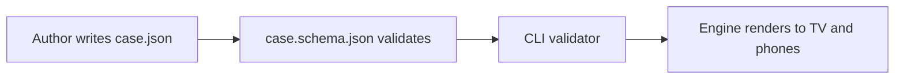

# Authoring guide

How to author a new case for the Mystery Engine. This guide is for **case authors** — humans, AI assistants, or both working together.

If you're not yet familiar with the product, read [`PRD.md`](PRD.md) first.
If you want the engine internals, read [`ARCHITECTURE.md`](ARCHITECTURE.md).

---

## 1. Quick start (10 minutes)

1. Copy the template:

   ```bash
   cp -r cases/_template cases/your-case-id
   ```

2. Open `cases/your-case-id/case.json` in Cursor / VS Code. The `$schema` line at the top gives you **autocomplete, hover docs, and inline validation** for every field.

3. Edit fields. Start with these schema fields, then test the complete game flow; schema validity alone does not establish playability:

   - `meta` — title, tagline, setting, age rating
   - 3+ suspects, each with a portrait, persona, alibi, true timeline, ≥1 breaking point
   - 1+ evidence item
   - Enough chapters to introduce suspects, hold ≥1 interview, run an accusation, and a reveal
   - 1+ rounds
   - The `endgame` and `solution` blocks

4. Validate:

   ```bash
   npm run validate-case your-case-id
   ```

   Fix any red `ERROR` lines. Yellow `warn` lines about missing asset files are fine until you create the art.

5. Add assets to `cases/your-case-id/assets/`:

   - `portraits/` — one per suspect (recommended ~512×768 portrait)
   - `locations/` — one wide image per named location (~1920×1080)
   - `crime-scene/` — planned scene-photo assets; the general asset route does not currently expose this folder
   - `audio/` — planned soundtrack cues; playback is not integrated
   - `ui/` — optional cover image and theme assets

6. Add printables to `cases/your-case-id/printables/` (HTML files that the host prints or shows on-screen between rounds).

7. Run validation again and rehearse the case. The picker discovers case folders independently of validation (or shows only `CASE_ID` when configured). Do not assume appearing in the picker proves the content is valid.

---

## 2. The mental model

A case is a **JSONC document plus assets**. Run the CLI validator explicitly before playing: the current runtime loader parses/casts without validation. Case independence is a design goal; existing round/phase assumptions and unsupported legacy gates still need a second-case integration test. See [current architecture](ARCHITECTURE.md).



Two big ideas the schema captures:

- **Surface vs truth** — every suspect has a `publicAlibi` (what they say) and a `trueTimeline` (what they actually did). Roleplay receives the public alibi and approved admissions, not the private true timeline.
- **Phase gating** — the case lays out exactly which facts/secrets/breaking-points are visible at which point. The solution object stays out of roleplay. Live discoveries use `unlockBehavior`; legacy `revealOnlyIf` alone is not executed by that pipeline. Authored admitted text enters the prompt only after the discovery is earned or the host uses assistance.

---

## 3. Anatomy of `case.json`

### `meta`

Shown on the case picker. Most fields are display strings — but `ageRating` and `contentNotes` are real product-safety surfaces. Be honest.

### `victim`

The corpse. `publicBackground` is what players learn during the brief. `causeOfDeath` is what the official ruling says (which the players may end up contradicting).

### `rounds`

A round is a thematic chunk of the game. Mussoorie uses four: *The Scene → Suspects Crack → The Connection → The Solve*. You can use as few as one or as many as needed. Rounds are mainly a UI grouping for the case board and a tag on chapters / evidence.

### `locations`

Named places. Every chapter and evidence item can optionally reference a `locationId`. The TV uses location images as scene backdrops during interviews and narrative beats.

### `suspects`

The heart of the case. For each one:

- `persona` — private author character reference; not passed to current roleplay. Keep `shortDescription`, `voice` and `knownFacts` free of unreleased secrets because they supply public/approved context.
- `voice` — speaking-style guidance. E.g., *"clipped British English, dry sarcasm, rarely more than two sentences."*
- `publicAlibi` — the story they tell publicly. Always in the LLM context.
- `trueTimeline` — an ordered list of what they actually did. This remains private reference data; author a supported unlock behavior and admitted text for anything that should enter live dialogue.
- `lies` — for each lie, give the topic, what they say, and what's actually true. These are private references; current roleplay uses the public alibi and earned admissions rather than both sides of each lie.
- `secrets` — hidden information; add `unlockBehavior` for current runtime discovery. Each has a `revealedText` (what they admit) and an optional `hint` (a vague tease when pressed before unlock).
- `breakingPoints` — evidence/chapter triggers that crack the suspect. Every suspect needs at least one. The `reaction` text becomes part of the LLM context after the trigger fires.
- `neverReveal` — private author reference. The current roleplay prompt excludes this list rather than revealing forbidden facts to the model.
- `guiltCategory` — for the guilt-map reveal. One of: `mastermind`, `executor`, `accomplice`, `accessory`, `tamperer`, `moral-cowardice`, `moral-bystander`, `innocent`.

### `evidence`

Each item has a `revealedInRound` (which round it appears in) and an `unlockedAtChapter` (the chapter that puts it in the locker). Items can reference suspects via `relatesToSuspectIds` (the UI highlights those suspects on the board).

`triggersChapter` is schema metadata, not a current runtime auto-advance mechanism. Use `unlockBehavior` for interview discoveries and `arrivesWhen` for host forensic releases. Phase changes remain explicit host actions.

### `chapters`

Discriminated union by `type`:

- `narrative` — authored text beats on the TV; narration audio is not integrated
- `evidence-reveal` — unlocks one or more evidence items; optionally with a `printablePrompt` ("Open Case File 3 now.")
- `interview` — a live LLM chat with `suspectId`. The `intro` is shown before the chat begins.
- `phone-hack` — schema support for a planned minigame; the current screen is a placeholder
- `accusation` — the group votes
- `reveal` — the killer is revealed; runs the `endgame` and `solution` reveal narration

Each chapter has `prerequisites` — a list of chapter ids that must be completed first. The validator enforces a DAG (no cycles).

### `atmosphericThreads`

Slow-burn narrative threads that span multiple chapters and resolve late (e.g., Mussoorie's "Grey Lady"). These are authoring metadata; automatic thread tracking/resolution is not implemented.

### `backstory`

Optional layer of events that happened **before** the game starts (e.g., a cold case). Players "uncover" backstory via evidence. Guilty suspects who know the backstory can reveal pieces of it when broken; innocent suspects shouldn't be told it.

### `endgame`

The final confrontation uses the highest vote total among the authored branch suspects, with ties selecting the first path. Each `EndgamePath` has a `triggerSuspectId` and a `scriptedSuspectLine` — the canonical opening line displayed directly by the staged reveal. Useful when you want a specific dramatic beat (the mastermind's framed defence, the executor's panicked confession).

### `solution`

`killerSuspectIds` is a list (can be one or many). For multi-killer cases, use `killerRoles` to label each (`mastermind`, `executor`, `accomplice`). The accusation step accepts a single answer but the reveal explains the full structure. The current reveal shows all responsible suspects; personalized partial-credit scoring is not implemented.

`closingQuestion` is authored discussion metadata; it is not currently projected/rendered by the reveal UI.

---

## 4. The schema is the single source of truth

The file `src/engine/schema/case.schema.json` is the authoritative contract. Three artifacts derive from it:

1. **Inline IDE help** — VS Code / Cursor use the `$schema` reference at the top of each `case.json` for autocomplete and hover docs.
2. **TypeScript types** — `src/engine/types.ts` is auto-generated. Run `npm run types:generate` after editing the schema.
3. **CLI validator** — `npm run validate-case <id>` uses ajv to validate against the schema, plus cross-reference checks.

If you ever feel the schema is in the way of your case, **change the schema** — don't work around it. Then regenerate types and re-run the validator everywhere.

---

## 5. Writing for the LLM

The engine sends approved public context and admitted facts, not the whole character sheet. A few rules of thumb:

- **Be concrete.** Vague personas produce vague characters. "Defensive when pressed" is good; "complex" is not.
- **Write voice prescriptively.** Sentence length, register, dialect quirks. The LLM follows these closely.
- **Keep private truth out of public prose.** Use `revealedText` or breaking-point `reaction` for earned admissions. Do not put the answer in a suspect description or voice instruction.
- **Use breaking points to push drama.** When the players present `cctv-still-camels-back`, the suspect doesn't just confirm — they "drop the alibi and admit they were walking." Make these reactions specific.
- **Treat `neverReveal` as author guidance.** It is not an enforcement mechanism. The runtime relies on approved-context filtering and reply validation; keep authored fallback revelations family-friendly too.

---

## 6. Drafting a case with an LLM

The schema is well-suited to LLM authoring because it's structured JSON. Copy the prompt below into Gemini, ChatGPT, or Claude, fill in your premise, and iterate.

### Suggested LLM prompt

> I'm writing a cooperative murder mystery case for the Mystery Engine, a family-friendly party game for 6–8 players (ages 10+). The case is shipped as a single `case.json` file conforming to the JSON Schema below.
>
> Premise:
> - **Setting**: \[where, when, era\]
> - **Victim**: \[who, what happened to them, what they were like\]
> - **Number of suspects**: 6
> - **Tone**: family-friendly, Agatha Christie energy, no gore or romance
> - **Number of rounds**: 4
> - **Key twist**: \[the hidden truth that pivots the case mid-game\]
>
> Please draft a complete `case.json` that validates against the schema. Pay particular attention to:
> 1. Every suspect has a `publicAlibi`, a `trueTimeline`, and ≥1 `breakingPoint`.
> 2. The killer's identity goes only in `solution.killerSuspectIds`, never in any suspect's `knownFacts` or `persona`.
> 3. Every evidence id, chapter id, suspect id, and round number referenced must resolve.
> 4. Chapter `prerequisites` form a DAG.
> 5. Use the `atmosphericThreads` field for any slow-burn clue that resolves late in the case.
>
> \[paste contents of `src/engine/schema/case.schema.json` here\]

Then validate the draft:

```bash
npm run validate-case your-case-id
```

The validator returns specific errors (`evidence "x" references unknown suspect "y"`) — paste those back into the LLM for it to fix. Iterate until the validator is green.

---

## 7. Writing printables

Player-facing physical case files live in `cases/<id>/printables/`. The standard convention is one HTML file per round (`Round1_*.html`, `Round2_*.html`, ...). Each file is designed with `@media print` styles so the host can print directly from the browser or save as PDF.

There is no schema requirement for printables — they're optional. But for a polished experience, ship at least one document per evidence item that benefits from being a physical prop (police reports, phone records, anonymous letters, photographs).

---

## 8. Family-friendly content

If your case targets ages 10+:

- No on-screen depiction of violence; deaths are referenced through evidence (lathi mark, broken railing) rather than shown.
- No graphic autopsy text. Use clinical phrasing ("blunt force injury consistent with a fall") rather than gore.
- No romance, substance abuse, or sexual content.
- No real-world targeting (don't write thinly veiled real people).
- Set `ageRating` honestly in `meta.ageRating` and disclose anything edgy in `meta.contentNotes`.

The LLM system prompt enforces the same tone — the engine won't override your `ageRating`, so be deliberate.

---

## 9. Testing your case

Before declaring done:

1. **Validator green** — `npm run validate-case <id>` returns 0 errors.
2. **Read the design doc end-to-end** — pretend you're a player. Does the clue chain hang together? Does every breaking point have a clear "aha" moment?
3. **Run a playtest** — even a solo run-through in Solo mode catches pacing problems.
4. **Family-friendly check** — show the LLM prompts (system prompts, suspect personas) to a peer and confirm nothing slipped through.

---

## 10. Common validator messages

| Message | What it means | Fix |
|---|---|---|
| `evidence "x" references unknown suspect "y"` | `relatesToSuspectIds` has an id with no matching suspect | Add the suspect or fix the id |
| `chapter "x" references unknown prerequisite "y"` | A `prerequisites` entry doesn't exist | Add the chapter or remove the prereq |
| `chapter dependency cycle: a -> b -> a` | Your chapter DAG has a loop | Restructure so chapters point only forward |
| `solution.killerSuspectIds references unknown suspect "x"` | Killer id doesn't match any suspect | Fix the id or add the suspect |
| `case targets engineVersion "X" but this engine is Y` | Your `engineVersion` range excludes this engine version | Loosen the range or upgrade the engine |
| `warn  suspect "x".portraitUrl not found on disk` | Portrait file isn't there yet | Add the art, or ignore until Phase 4 |

---

*This guide will grow as the engine grows. Open a pull request if you find a step that needs clarifying.*
